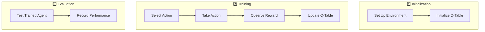

# Machine Learning 2 - Reinforcement Learning Labs and Homework

This repository contains the labs and homework assignments for the **Machine Learning 2** course, focusing on **Reinforcement Learning**. Each lab includes a Jupyter Notebook with detailed code, explanations, and results. Additionally, each lab has a video demonstration of the environment and the agent's performance.

## Table of Contents

1. [HomeWork](#homework)
2. [TP1: CartPole-v1](#tp1-cartpole-v1)
3. [TP2: FrozenLake-v1](#tp2-frozenlake-v1)
4. [TP3: Q-Learning vs SARSA](#tp3-q-learning-vs-sarsa)
5. [TP4: Taxi-v3](#tp4-taxi-v3)

## HomeWork

### Description
The HomeWork section contains practice and introductory exercises for the Reinforcement Learning course. These exercises are designed to familiarize students with classic RL concepts using Python.

### Files
- [HomeWork.py](./HomeWork/HomeWork.py)
- [HomeWorkAnimation.py](./HomeWork/HomeWorkAnimation.py)

---

## TP1: CartPole-v1

### Description
Introduction to reinforcement learning concepts using the `CartPole-v1` environment.

### Workflow Overview



### Video Demonstration
<video controls>
  <source src="./TP1/CartPole-v1.mp4" type="video/mp4">
  Your browser does not support the video tag.
</video>

### Results


### Files
- [CartPole-v1.mp4](./TP1/CartPole-v1.mp4)
- [CartPole.png](./TP1/CartPole.png)
- [TP1.ipynb](./TP1/TP1.ipynb)

---

## TP2: FrozenLake-v1

### Description
Implementing the Q-learning algorithm to solve the `FrozenLake-v1` environment.

### Workflow Overview


### Video Demonstration
<video controls>
  <source src="./TP2/FrozenLake.mp4" type="video/mp4">
  Your browser does not support the video tag.
</video>

### Results


### Files
- [FrozenLake.mp4](./TP2/FrozenLake.mp4)
- [FrozenLake.png](./TP2/FrozenLake.png)
- [TP2.ipynb](./TP2/TP2.ipynb)

---


## TP3: Q-Learning vs SARSA

### Description
Comparing **Q-Learning** and **SARSA** algorithms to solve the `CartPole-v1` environment.

### Workflow Overview

```mermaid
flowchart TB
    Init1[1️⃣ Initialization]
    A1[Set Up Environment]
    B1[Initialize Q-Table]

    Init1 --> A1
    Init1 --> B1

    Training1[2️⃣ Training]
    C1[Select Action]
    D1[Take Action]
    E1[Observe Reward]
    F1[Update Q-Table (Q-Learning)]
    G1[Update Q-Table (SARSA)]

    Training1 --> C1
    C1 --> D1
    D1 --> E1
    E1 --> F1
    E1 --> G1

    Evaluation1[3️⃣ Evaluation]
    H1[Test Trained Agent (Q-Learning)]
    I1[Record Performance (Q-Learning)]
    J1[Test Trained Agent (SARSA)]
    K1[Record Performance (SARSA)]

    Evaluation1 --> H1
    Evaluation1 --> I1
    Evaluation1 --> J1
    Evaluation1 --> K1
```

### Results


### Files
- [qlearning_vs_sarsa.png](./TP3/qlearning_vs_sarsa.png)
- [TP3.ipynb](./TP3/TP3.ipynb)
- [traffic_env.py](./TP3/traffic_env.py)

---

## TP4: Taxi-v3

### Description
Implementing the **PPO** (Proximal Policy Optimization) algorithm to solve the `Taxi-v3` environment.

### Workflow Overview

```mermaid
flowchart TB
    Init2[1️⃣ Initialization]
    A2[Set Up Environment]
    B2[Initialize Policy and Value Tables]

    Init2 --> A2
    Init2 --> B2

    Training2[2️⃣ Training]
    C2[Select Action]
    D2[Take Action]
    E2[Observe Reward]
    F2[Update Policy and Value Tables (PPO)]

    Training2 --> C2
    C2 --> D2
    D2 --> E2
    E2 --> F2

    Evaluation2[3️⃣ Evaluation]
    G2[Test Trained Agent]
    H2[Record Performance]

    Evaluation2 --> G2
    Evaluation2 --> H2
```

### Video Demonstration
<video controls>
  <source src="./TP4/Taxi-v3.mp4" type="video/mp4">
  Your browser does not support the video tag.
</video>

### Results


### Files
- [Taxi-v3.mp4](./TP4/Taxi-v3.mp4)
- [Taxi.png](./TP4/Taxi.png)
- [TP4.ipynb](./TP4/TP4.ipynb)


---

## Usage

To run the labs and homework, follow these steps:

1. Clone the repository:
   ```bash
   git clone https://github.com/your-username/your-repo-name.git
   ```

2. Install the required dependencies:
   ```bash
   pip install gymnasium numpy matplotlib
   ```

3. Open the Jupyter Notebook for each lab and run the cells.

---

## Contributing

Feel free to contribute to this repository by submitting pull requests or opening issues.

---

## License

This project is licensed under the MIT License - see the [LICENSE](LICENSE) file for details.

---

## Contact

For any questions or feedback, please contact Oussama ELHADJI at [oussousselhadji@gmail.com](mailto:oussousselhadji@gmail.com).

---

## Author

- **Name**: Oussama ELHADJI
- **School**: École Nationale de l'Intelligence Artificielle et du Digital Berkane
- **Professor**: Mohamed Khalifa BOUTAHIR
