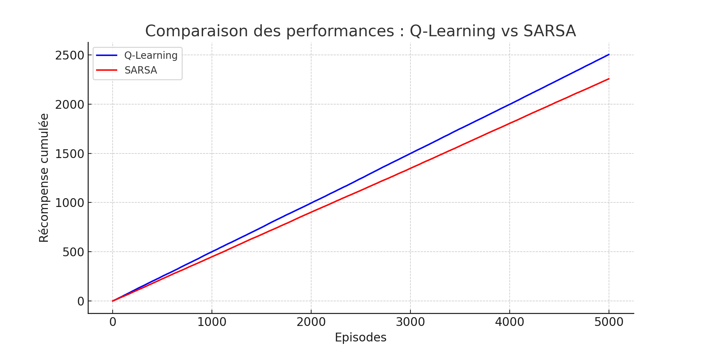

# Machine Learning 2 - Reinforcement Learning Labs and Homework

This repository contains the labs and homework assignments for the Machine Learning 2 course, focusing on Reinforcement Learning. Each lab includes a Jupyter Notebook with detailed code, explanations, and results. Additionally, each lab has a video demonstration of the environment and the agent's performance.

## Table of Contents

1. [HomeWork](#homework)
2. [TP1: CartPole-v1](#tp1)
3. [TP2: FrozenLake-v1](#tp2)
4. [TP3: Q-Learning vs SARSA](#tp3)
5. [TP4: Taxi-v3](#tp4)

## HomeWork

### Description
Exploring advanced topics in reinforcement learning, including deep reinforcement learning techniques.

### Video Demonstration
[](./HomeWork/HomeWork.mp4)

### Code Structure
- **Initialization**: Setting up the environment and initializing the neural network.
- **Training**: Implementing advanced reinforcement learning algorithms.
- **Evaluation**: Testing the trained agent.

### Results
- **Graphs**: [Link to graphs](./HomeWork/)

### Files
- [HomeWork.py](./HomeWork/HomeWork.py)
- [HomeWorkAnimation.py](./HomeWork/HomeWorkAnimation.py)

## TP1: CartPole-v1

### Description
Introduction to reinforcement learning concepts using the `CartPole-v1` environment.

### Video Demonstration
[](./TP1/CartPole-v1.mp4)

### Code Structure
- **Initialization**: Setting up the environment and initializing the Q-table.
- **Training**: Implementing the Q-learning algorithm.
- **Evaluation**: Testing the trained agent.

### Results
- **Graphs**: [Link to graphs](./TP1/)

### Files
- [CartPole-v1.mp4](./TP1/CartPole-v1.mp4)
- [TP1.ipynb](./TP1/TP1.ipynb)

## TP2: FrozenLake-v1

### Description
Implementing the Q-learning algorithm to solve the `FrozenLake-v1` environment.

### Video Demonstration
[](./TP2/FrozenLake.mp4)

### Code Structure
- **Initialization**: Setting up the environment and initializing the Q-table.
- **Training**: Implementing the Q-learning algorithm.
- **Evaluation**: Testing the trained agent.

### Results
- **Graphs**: [Link to graphs](./TP2/)

### Files
- [FrozenLake.mp4](./TP2/FrozenLake.mp4)
- [TP2.ipynb](./TP2/TP2.ipynb)

## TP3: Q-Learning vs SARSA

### Description
Comparing Q-Learning and SARSA algorithms to solve the `CartPole-v1` environment.

### Video Demonstration
[](./TP3/qlearning_vs_sarsa.png)

### Code Structure
- **Initialization**: Setting up the environment and initializing the policy network.
- **Training**: Implementing the Q-learning and SARSA algorithms.
- **Evaluation**: Testing the trained agent.

### Results
- **Graphs**: [Link to graphs](./TP3/)

### Files
- [qlearning_vs_sarsa.png](./TP3/qlearning_vs_sarsa.png)
- [TP3.ipynb](./TP3/TP3.ipynb)
- [traffic_env.py](./TP3/traffic_env.py)

## TP4: Taxi-v3

### Description
Implementing the PPO algorithm to solve the `Taxi-v3` environment.

### Video Demonstration
[](./TP4/Taxi-v3.mp4)

### Code Structure
- **Initialization**: Setting up the environment and initializing the policy and value tables.
- **Training**: Implementing the PPO algorithm.
- **Evaluation**: Testing the trained agent.

### Results
- **Graphs**: [Link to graphs](./TP4/)

### Files
- [Taxi-v3.mp4](./TP4/Taxi-v3.mp4)
- [TP4.ipynb](./TP4/TP4.ipynb)

## Usage

To run the labs and homework, follow these steps:

1. Clone the repository:
   ```bash
   git clone https://github.com/your-username/your-repo-name.git
